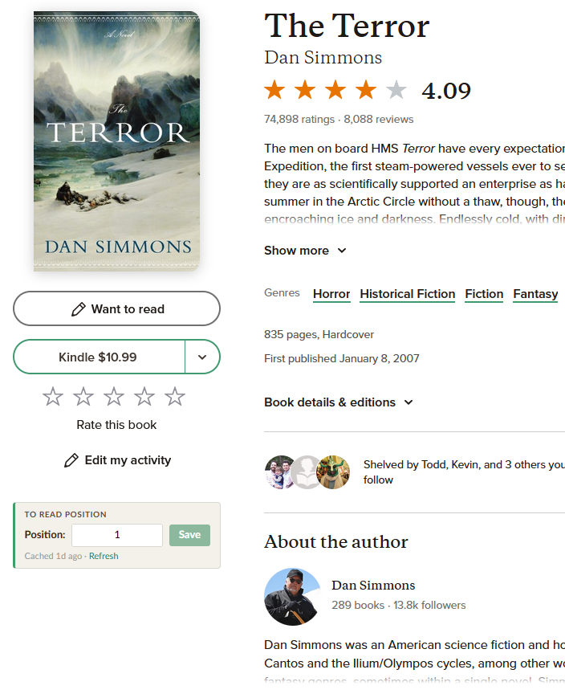
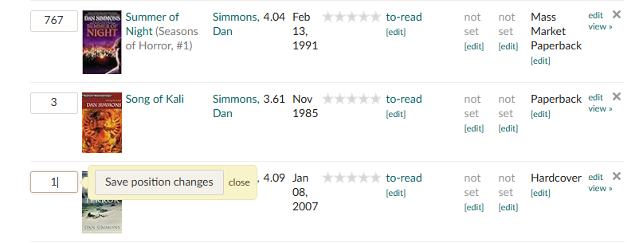

# Goodreads Shelf Position Editor

A Firefox browser extension that adds shelf position editing to Goodreads book pages and shelf search results, making it easy to view and update where a book sits on your To Read list.

## Why

Goodreads lets you order your To Read shelf by position, but editing a book's position requires navigating to the shelf page, and the shelf's search view doesn't display the position column at all. This extension surfaces that information directly on each book's detail page, where it's most useful.

## What It Does

### Book pages

On any Goodreads book page (`goodreads.com/book/show/...`), a small widget appears near the shelf buttons:



- **Book is on your To Read shelf** — shows an editable position field with Save and Refresh controls
- **Book is not on your shelf** — shows a short notice instead

Edit the number, press Enter or click Save, and the position updates immediately.

### Shelf search results

When you search your To Read shelf, Goodreads hides the position column. This extension adds it back:



Each book in the search results gets an editable position field. Change a value and press Enter or Tab to save — a green flash confirms success.

## Install

### From AMO (recommended)

**[Install from addons.mozilla.org](https://addons.mozilla.org/en-US/firefox/addon/goodreads-shelf-position-edit/)** — automatic updates included.

### From a GitHub release

1. On the [Releases](https://github.com/evanwon/goodreads-shelf-position-editor/releases) page, click the `.xpi` asset for the latest version
2. Firefox will prompt you to install the extension — click **Add**

### From source (temporary install)

1. Clone this repo and run `npm ci --ignore-scripts`
2. Run `npm run dev` to launch Firefox with the extension loaded
   — or open `about:debugging#/runtime/this-firefox`, click **Load Temporary Add-on**, and select `src/manifest.json`

## Usage

**On book pages:**
1. Visit any book page on `goodreads.com`
2. The widget appears with a brief loading indicator while it fetches your shelf data
3. If the book is on your To Read shelf, edit the position and press **Enter** or click **Save**
4. A green flash confirms the save

**On shelf search results:**
1. Go to your To Read shelf and search for a book
2. A **#** (position) column appears in the search results
3. Edit any position and press **Enter** or **Tab** to save

The first page load fetches your full shelf data and caches it locally. Subsequent visits to any book page resolve instantly from cache. Cache expires after one week by default — configurable in the extension's options (Add-ons Manager > Goodreads Shelf Position Editor > Options). If you reorder your shelf directly on Goodreads, click the refresh button on the widget to re-sync.

## How It Works

**Book pages** (`content.js`):
1. Extracts the book ID from the page URL
2. Searches your To Read shelf to confirm the book is present and find its review ID
3. Looks up the book's shelf position from cached shelf data (fetches on first visit)
4. Injects a position input widget on the page
5. Saves position changes via Goodreads' internal endpoints

**Shelf search results** (`shelf.js`):
1. Detects when a search is active on a To Read shelf view
2. Injects a position column header and editable cells into the results table
3. Resolves each book's shelf ID and position from cached shelf data
4. Saves inline edits via the same Goodreads endpoints

All requests go directly to `goodreads.com` using your existing session. No external servers are contacted. See [PRIVACY.md](PRIVACY.md) for full details.

## Development

### Setup

```sh
git clone https://github.com/evanwon/goodreads-shelf-position-editor.git
cd goodreads-shelf-position-editor
npm ci --ignore-scripts
npm test
```

### Commands

| Command | Description |
|---|---|
| `npm test` | Run unit tests |
| `npm run test:watch` | Run tests in watch mode |
| `npm run test:coverage` | Generate coverage report |
| `npm run lint:firefox` | Validate extension with web-ext |
| `npm run build:firefox` | Lint + build `.xpi` |
| `npm run dev` | Launch Firefox with the extension loaded |
| `npm run test:build` | Full pre-commit check (test + lint + build) |
| `npm run version:bump` | Automate version bumps (see [Releases](#releases)) |
| `npm run version:check` | Validate manifest/package.json version consistency |

### Project layout

Extension source lives in `src/`, tests in `test/`. CI/CD uses shared reusable workflows from [`evanwon/browser-extension-workflows`](https://github.com/evanwon/browser-extension-workflows). See [CLAUDE.md](CLAUDE.md) for detailed architecture notes.

## Releases

Releases are driven by git tags via shared GitHub Actions workflows from [`evanwon/browser-extension-workflows`](https://github.com/evanwon/browser-extension-workflows):

- **Stable** — push a tag like `v1.0.0` to build, optionally submit to AMO, and create a GitHub release
- **Pre-release** — push a tag like `v1.1.0-rc1` to build, sign as unlisted, and create a GitHub pre-release
- **Manual** — trigger via `workflow_dispatch` for ad-hoc test builds

### Version Management

Use `npm run version:bump` to automate version updates, commits, and tags:

```sh
# Stable releases
npm run version:bump patch       # 1.0.3 -> 1.0.4
npm run version:bump minor       # 1.0.3 -> 1.1.0
npm run version:bump major       # 1.0.3 -> 2.0.0

# Pre-release lifecycle
npm run version:bump rc patch    # 1.0.3 -> 1.0.4-rc1 (start RC)
npm run version:bump rc          # 1.0.4-rc1 -> 1.0.4-rc2 (iterate)
npm run version:bump stable      # 1.0.4-rc2 -> 1.0.4 (promote)

# Then push the tag to trigger the build
git push origin v1.0.4
```

Options: `--dry-run` to preview, `--no-git` to update files only. Run `npm run version:check` to validate version consistency between `manifest.json` and `package.json`.

## Requirements

- Firefox 109+ (Manifest V3)
- A Goodreads account with books on your To Read shelf
- Node.js 22+ and npm (for development only)

## License

[MIT](LICENSE)

## Disclaimer

This project is an independent, community-developed browser extension. It is not affiliated with, endorsed by, or associated with Goodreads, Amazon, or any of their subsidiaries.

Goodreads is a trademark of Goodreads, LLC. Amazon is a trademark of Amazon.com, Inc. These names are used here solely to describe the extension's functionality and the website it interacts with.

This extension accesses Goodreads using your existing browser session and does not use any official Goodreads API. Goodreads may change their website at any time, which could affect the extension's functionality.
